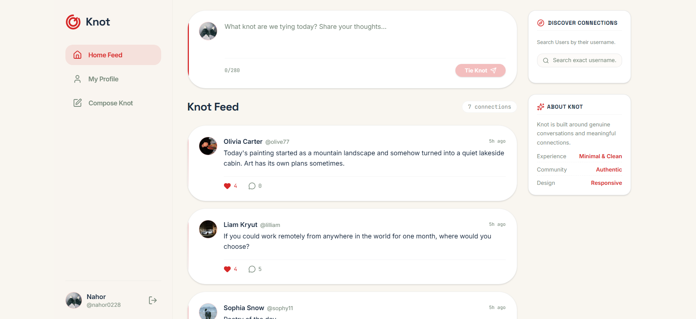
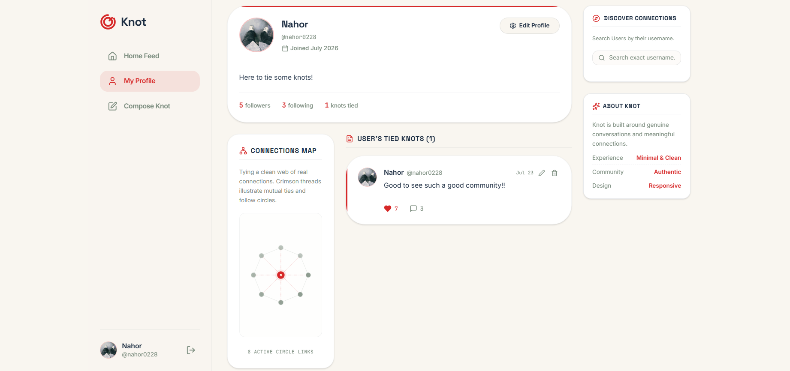
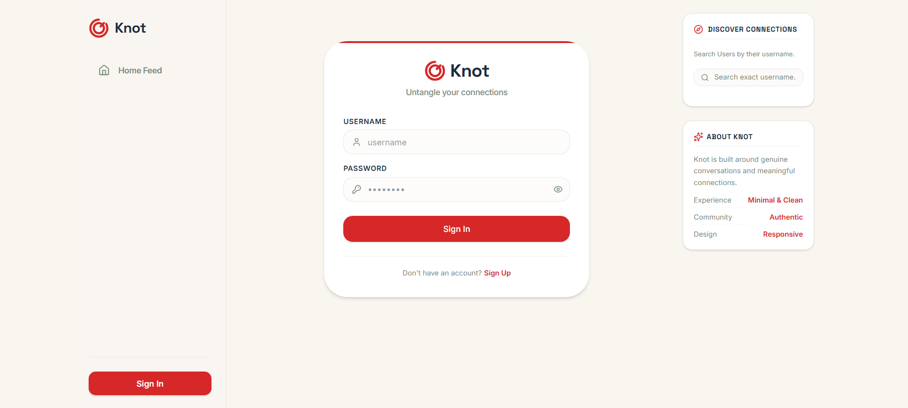
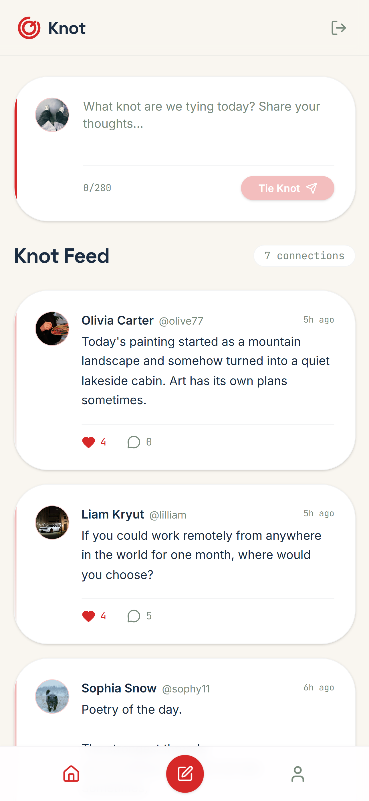
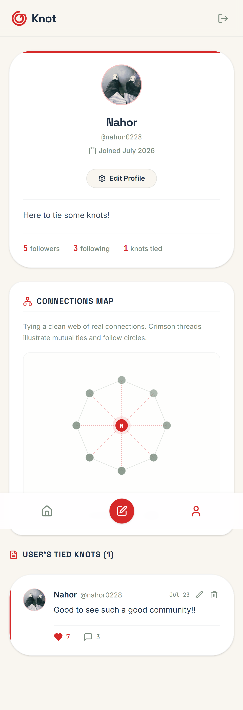

# Knot 🔴

Knot is a minimalist full-stack social media application focused on meaningful connections and clean, distraction-free interaction. It is built with React, TypeScript, Express, and SQLite, providing a lightweight yet fully functional social networking experience.

---

## Screenshots

### Desktop

#### Home Feed



#### Profile



#### Authentication



### Mobile

#### Home Feed



#### Profile



---

## 🚀 Key Features

### 1. User Authentication & Session Management
- **Security First**: High-grade password hashing utilizing Node's native `crypto` (PBKDF2 with unique cryptographic salt per user), avoiding heavy binary dependencies.
- **Stateful Sessions**: Secure authentication using encrypted passwords, persistent sessions, and HttpOnly cookies.
- **Protected Routing**: Real-time server-side cookie authentication checks that prevent unauthorized actions.

### 2. User Profiles
- Custom user statistics showing `Followers`, `Following`, and total `Knots Tied`.
- Inline configuration panel allowing display name changes, personal bio updates (with automatic count validation), and customizable profile picture options (supporting custom links and gorgeous curated photo presets).

### 3. Dynamic Knot Feed (Posts)
- Publish, edit, and delete user-authored content up to 280 characters with dynamic live character countdown.
- Relative real-time relative timestamps.

### 4. Interactive Like System
- Like and unlike posts with instant UI updates synchronized to the database. Like counts update instantaneously in the UI via optimistic updates and synchronize perfectly on the database.

### 5. Multi-User Conversation (Comments)
- View nested comment conversations on-demand, write responses, and delete own comments.

### 6. Relational Follower Circle (Follow System)
- Follow and unfollow users to build circles. Mutual follow statistics adjust in real-time.

---

## 🛠 Tech Stack

**Frontend**
- React 19
- TypeScript
- Vite
- Tailwind CSS 

**Backend**
- Node.js
- Express.js

**Database**
- SQLite

**Authentication**
- Cookie-based sessions
- PBKDF2 password hashing

---
## 🎨 Visual Philosophy & Aesthetic
Inspiration was taken directly from the minimalist wireframe concept, translating into a responsive cream-colored display featuring:
- **Crimson Red (#D62828)**: Utilized as a bold visual accent and representation of connecting threads.
- **Deep Ink Blue (#1C2D42)**: Paired elegantly for core typography and high-contrast readable elements.
- **Muted Sage (#7A8B7D)**: Used as a calm neutral secondary color for counters, timestamps, and secondary buttons.
- **Cream (#F9F6F0)**: A clean, soft, modern off-white background to avoid bright eye strain.
- **Inter & Space Grotesk**: Refined typographic pairings that give a high-tech yet incredibly clean vibe.
- **Connections Map**: An interactive, dynamic SVG circular web graph on the user profile that displays a visual mesh of connected followers/circles connected by crimson lines.


---

## Project Structure

Knot/
|
|── screenshots/
|   |── auth-desktop.png
|   |── home-desktop.png
|   |── home-mobile.png
|   |── login-desktop.png
|   └── profile-mobile.png
|
|── server/
|   |── database/
|   |   └── db.ts
|   |── middleware/
|   |   └── auth.ts
|   └── routes/
|       └── api.ts
|
|── src/
|   |── assests/
|   |   └── logo.svg
|   |── components/
|   |── lib/
|   |── styles/
|   |── types/
|   |── App.tsx
|   |── main.tsx
|   └── vite-env.d.ts
|
|── .gitignore
|── index.html
|── package-lock.json
|── package.json
|── README.md
|── sever.ts
|── tsconfig.json
└── vite.config.ts

---

## 🗄️ Relational Database Schema (SQLite)

The application utilizes **SQLite** with **foreign keys explicitly enabled on startup** to strictly enforce relational constraints.

```sql
-- 1. Users Table
CREATE TABLE users (
  id INTEGER PRIMARY KEY AUTOINCREMENT,
  username TEXT UNIQUE NOT NULL,
  password_hash TEXT NOT NULL,
  display_name TEXT NOT NULL,
  bio TEXT,
  profile_picture TEXT,
  join_date TEXT DEFAULT CURRENT_TIMESTAMP
);

-- 2. Sessions Table (for secure authentication)
CREATE TABLE sessions (
  token TEXT PRIMARY KEY,
  user_id INTEGER NOT NULL,
  expires_at TEXT NOT NULL,
  FOREIGN KEY (user_id) REFERENCES users (id) ON DELETE CASCADE
);

-- 3. Posts Table
CREATE TABLE posts (
  id INTEGER PRIMARY KEY AUTOINCREMENT,
  author_id INTEGER NOT NULL,
  content TEXT NOT NULL,
  timestamp TEXT DEFAULT CURRENT_TIMESTAMP,
  FOREIGN KEY (author_id) REFERENCES users (id) ON DELETE CASCADE
);

-- 4. Comments Table
CREATE TABLE comments (
  id INTEGER PRIMARY KEY AUTOINCREMENT,
  post_id INTEGER NOT NULL,
  author_id INTEGER NOT NULL,
  content TEXT NOT NULL,
  timestamp TEXT DEFAULT CURRENT_TIMESTAMP,
  FOREIGN KEY (post_id) REFERENCES posts (id) ON DELETE CASCADE,
  FOREIGN KEY (author_id) REFERENCES users (id) ON DELETE CASCADE
);

-- 5. Likes Table
CREATE TABLE likes (
  post_id INTEGER NOT NULL,
  user_id INTEGER NOT NULL,
  PRIMARY KEY (post_id, user_id),
  FOREIGN KEY (post_id) REFERENCES posts (id) ON DELETE CASCADE,
  FOREIGN KEY (user_id) REFERENCES users (id) ON DELETE CASCADE
);

-- 6. Followers Table
CREATE TABLE followers (
  follower_id INTEGER NOT NULL,
  following_id INTEGER NOT NULL,
  PRIMARY KEY (follower_id, following_id),
  FOREIGN KEY (follower_id) REFERENCES users (id) ON DELETE CASCADE,
  FOREIGN KEY (following_id) REFERENCES users (id) ON DELETE CASCADE
);
```

---

## ⚙️ Setup and Installation

### 1. Install Dependencies
```bash
npm install
```

### 2. Run the Development Server
```bash
npm run dev
```
The server will start running at `http://localhost:3000`.

### 3. Build for Production
```bash
npm run build
```
This runs Vite to compile client assets, and bundles the Node/Express backend using `esbuild` into a self-contained, high-performance CommonJS script (`dist/server.cjs`).

### 4. Start in Production
```bash
npm run start
```

---

## 🔒 Data Policy Compliance
The database starts **completely empty** (no pre-seeded dummy posts, fake users, or sample content). The database is initialized empty with no sample users or posts. All content is created through real user interaction.

---

## Future Improvements

- Real-time notifications
- Direct messaging
- Image uploads
- Dark mode
- User search and discovery
- Infinite scrolling
- Push notifications

---

## License 

This project is licensed under the MIT License.